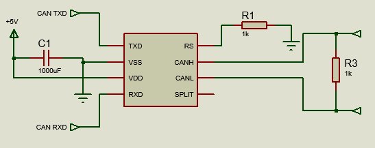

# LED Strip

---

## Hardware

* [ESP-WROOM-32](https://www.dzduino.com/Blog%20Dzduino/ESP32-WROOM-32) à
programmer sur Arduino IDE en sélectionnant *ESP32-WROOM-DA Module*

* Bande de LED type GRB

* **ATTENTION** l'ESP32 et la bande de LED doivent être sur la même alimentation

>
>*Test réalisés avec un condensateur de 1000µF et une résistance de 330Ω*

* CAN Transceiver MCP2561

>

 

| ESP32  |  LED Strip | MCP2561  |
|---|---|---|
|  VIN |  +5V  | /  |
|  GND | GND  | /  |
| 26  | DIN  | /  |
| 22  | /  |  TXD |
| 23  | /  | RXD  |

---

## Trame CAN

Liste des trames de chaque mode

###### Mode configuration

Le nombre de LED est un entier sur 16 bits, les 4 octets suivants sont les numéros de la première LED de chaque côté du robot (*exemple, si la bande de LED commence à l'arrière droite du robot et que chaque côté de robot contient 20 LED on aura les valeurs 0, 20, 40,60*)

| Octet 0 (Mode) |  Octet 1 | Octet 2  |Octet 3|Octet 4|Octet 5|Octet 6|
|---|---|---|---|---|---|---|
| 0 |Nombre de LED <15:8> |Nombre de LED <7:0>|Coordonnées début arrière|Coordonnées début gauche|Coordonnées début avant|Coordonnées début droite|

###### Mode Chargement

Ce mode est lancé dès que l'ESP32 est alimentée jusqu'à ce qu'une nouvelle trame soit reçue, on il n'a que la luminosité pour paramètre

| Octet 0 (Mode) |  Octet 1 |
|---|---|
| 1 | Luminosité |

###### Mode Coordonnées

Ce mode allume les LED selon les coordonnées et les valeurs R, G et B dans la trame, les LED en dehors des coordonnées gardent leur couleur précédente.

>**Le paramètre luminosité modifie toute la bande de LED**

| Octet 0 (Mode) |  Octet 1 | Octet 2  |Octet 3|Octet 4|Octet 5|Octet 6|
|---|---|---|---|---|---|---|
| 3 | Coordonnées de début |Coordonnées de fin|R|G|B|Luminosité|

###### Mode Arc-En-Ciel

| Octet 0 (Mode) |  Octet 1 |
|---|---|
| 3 | Luminosité |

###### Mode Couleur Uni

Toute la bande de LED s'allume à la couleur et la luminosité demandée

| Octet 0 (Mode) |  Octet 1 | Octet 2  |Octet 3|Octet 4|
|---|---|---|---|---|
| 4 |R|G|B|Luminosité|

###### Mode 5

Même paramètres qu'avant mais une LED sur deux s'allume

| Octet 0 (Mode) |  Octet 1 | Octet 2  |Octet 3|Octet 4|
|---|---|---|---|---|
| 5 |R|G|B|Luminosité|

###### Mode Clignontant

Ce mode utilise les coordonnées arrière, gauche, devant et droite afin d'afficher des clignotants sur la partie arrière. La direction du clignotant est choisi avec l'octet direction, si il est égal à 1 le clignotant va vers la droite, si il est égal à 0 le clignotant va à gauche. On a un également un paramètre de luminosité comme avant

| Octet 0 (Mode) |  Octet 1 | Octet 2  |
|---|---|---|
| 6 |Direction |Luminosité|

---

## Software

###### Bande de LED

Déclaration de la bande de LED , *strip*

`Adafruit_NeoPixel strip(Strip_Length, LED_PIN, NEO_GRB);`

Tableau contenant les données de couleurs, *Strip_Array* changer la taille du
tableau si le nombre de LED dépasse 500

`rgb Strip_Array[500];`

Ligne de c

`strip.updateLength(Strip_Length);`

###### Bus CAN

Filtre de réception

`CAN.filter(0x7FE);`

Fonction d'IT sur réception de trame

`CAN.onReceive(onReceive);`

###### Fonctionnement

Dès qu'on reçoit une trame dont l'ID correspond on va dans onReceive pour récupérer les valeurs dans la trame et les mettre dans les variables utilisées pour l'affichage

Pour l'affichage on utilise la fonction `void LED_Strip (uint8_t mode)`, elle a pour argument le mode récupéré dans la trame et va envoyer les données sur la bande de LED
